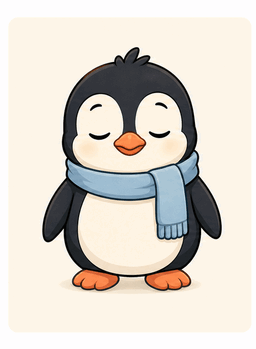

# Buddy



Buddy is a small Rust command-line assistant that indexes local machine context,
stores it in SQLite, and lets a Groq model answer questions about the snapshot.
Answers can be spoken through Voxd; Voxd's Mimic integration provides phonetic
memoization so repeated speech can reuse cached audio instead of paying for a
full synthesis every time.

Repository: <https://github.com/elci-group/buddy>

Buddy never sends the database itself. `ask` sends a bounded JSON view containing
the process list and at most 2,000 indexed filesystem entries by default.

## Build and install

```bash
cargo build --release
cargo install --path .
```

Set a Groq key before asking questions:

```bash
export GROQ_API_KEY="your-key"
```

The default model is `llama-3.3-70b-versatile`. Override it with `GROQ_MODEL`.

## Use

```bash
# Index HOME, or pass a smaller path for a faster/private snapshot.
buddy scan
buddy scan ~/projects

# Ask about the saved snapshot. Processes refresh on every question.
buddy ask "Which development tools are running?"

# Capture the screen just in time and let a vision model use its current state.
buddy ask --screen "What error is visible, and what should I try next?"

# Refresh the filesystem snapshot first and speak the response through Voxd.
buddy ask --refresh --speak "Summarise this machine"

# Inspect exactly what Buddy can send, without making a network request.
buddy context --limit 100
buddy context --screen --limit 100
buddy status

# Preview the terminal-safe animated penguin avatar.
buddy avatar

# Inspect or snapshot Buddy's adaptive Skillastic runtime.
buddy skillastic status
buddy skillastic list
buddy skillastic capture

# Plan offline, apply to OBS, or apply then reflect on the rendered scene.
buddy obs plan examples/obs-scene.json
buddy obs apply examples/obs-scene.json
buddy obs evaluate "Buddy Studio"
buddy obs compose examples/obs-scene.json

# Check stable releases; repeated checks are cached for six hours.
buddy update
buddy update --force
```

The first `ask` automatically scans `HOME` if no filesystem snapshot exists.
Later asks reuse the stored scan unless `--refresh` is supplied.

## Voxd and Mimic

`--speak` invokes `voxd-cli speak --project <path>`. This keeps provider keys,
playback, voice selection, daemon lifecycle, and caching inside Voxd. When Voxd
is configured with Mimic, missing speech spans are synthesized while reusable
phrase, word, morpheme, and diphone audio is served from Mimic's local cache.
Buddy caps spoken output at 2,000 characters by default.

Useful overrides:

- `BUDDY_VOXD_BIN` — alternate `voxd-cli` executable.
- `BUDDY_VOXD_PROJECT` — project path used for the stable Voxd voice (default `.`).
- `BUDDY_TTS_MAX_CHARS` — spoken character cap.
- `BUDDY_CONTEXT_LIMIT` — filesystem entries included in model context.
- `BUDDY_VISION_MODEL` — multimodal model used only with `--screen`.
- `BUDDY_SCREENSHOT_BIN` — custom screenshot executable receiving an output path.
- `BUDDY_SCREEN_MAX_BYTES` — maximum capture size in bytes (default 10 MiB).
- `BUDDY_NO_AVATAR` — disable terminal animation (`1`, `true`, `yes`, or `on`).
- `BUDDY_DB_PATH` — SQLite path; defaults to `$XDG_DATA_HOME/buddy/buddy.db` or
  `~/.local/share/buddy/buddy.db`.
- `GROQ_API_URL` — Groq-compatible chat completions endpoint.
- `BUDDY_RELEASE_REPO` — GitHub `owner/repository` release source (defaults to
  `elci-group/buddy`).
- `BUDDY_RELEASE_TAG_PREFIX` — stable release tag prefix (defaults to
  `v`, such as `v1.2.0`).

Speech is opt-in. Without `--speak`, Buddy does not start Voxd or play audio.
The local `context` and `status` commands never contact Groq.

## Skillastic integration

Buddy delegates bounded, read-oriented lifecycle operations to the installed
Skillastic CLI and emits its JSON unchanged. `status` and `list` inspect the
adaptive runtime; `capture` records a point-in-time snapshot. Set
`BUDDY_SKILLASTIC_BIN` to override the executable. Buddy deliberately does not
expose arbitrary Skillastic migration or mutation arguments through this layer.

The repository includes a versioned `obs-scene-management` skill under
`.skillastic/`, so its layout contract, safety boundaries, and operating steps
evolve alongside the application.

## OBS scene management

OBS layouts are declared as normalized rectangles in a JSON scene spec such as
`examples/obs-scene.json`. `buddy obs plan` is fully offline and deterministic:
it validates source identity and bounds, maps rectangles into a measured canvas
safe area, and reports coverage, disallowed overlap, and a layout score.

`apply` connects to OBS WebSocket, measures OBS's actual base canvas, creates or
reuses the named scene and inputs, sets bounds, ordering, visibility, and locks,
and activates the scene only when the spec opts in. Configure the connection
with `BUDDY_OBS_HOST` (default `127.0.0.1`), `BUDDY_OBS_PORT` (default `4455`),
and `OBS_WEBSOCKET_PASSWORD`.

`evaluate` captures the rendered scene through OBS—not the whole desktop—and
asks the configured vision model to assess hierarchy, balance, legibility,
safe-area use, cropping, dead space, and occlusion. `compose` applies and then
evaluates. The reflective result is advisory JSON: model output is never parsed
as executable OBS operations, so deterministic scene configuration remains the
authority.

## Just-in-time screen vision

Screen context is also opt-in. `buddy ask --screen` captures the current full
screen only for that request, reads it into memory, deletes the temporary image,
and sends it alongside the bounded machine snapshot to Groq's multimodal chat
API. Buddy does not cache screen pixels or write them to its database.

`buddy context --screen` performs the same ephemeral capture but prints only
capture metadata (`capture_tool`, MIME type, byte count, and time), never base64
pixels. This verifies the capture path without contacting a model or exposing
the image in terminal output.

The default vision model is `qwen/qwen3.6-27b`. Override it with
`BUDDY_VISION_MODEL`. Buddy tries `grim`, `gnome-screenshot`, `spectacle`,
`scrot`, and ImageMagick `import` on Linux, or `screencapture` on macOS. Set
`BUDDY_SCREENSHOT_BIN` to use a custom executable that accepts the destination
path as its final argument. Captures are capped at 10 MiB by default; adjust
`BUDDY_SCREEN_MAX_BYTES` when needed.

Screen images can contain passwords, private messages, or other sensitive data.
Review the visible desktop before using `--screen`. Buddy labels text visible in
the image as untrusted content in its model prompt so on-screen instructions do
not override the user's question.

## Penguin avatar

Buddy animates a compact penguin on interactive terminals while it captures or
waits for Groq. Redirected output stays clean, `--no-avatar` disables animation
for one question, and `BUDDY_NO_AVATAR=1` disables it globally. The generated
mascot artwork and animation live in `assets/`.

## Stable update detection

`buddy update` reads GitHub Releases, rejects drafts and prereleases, requires
an exact three-part semantic version after the configured tag prefix, and picks
the numerically newest release rather than trusting API order. Results are
cached in Buddy's database for six hours; `--force` bypasses the cache.

Update checks are read-only: Buddy reports the release page but never downloads
or executes an installer. Exact prefix filtering prevents unrelated tag formats
from being mistaken for a stable Buddy build. Set `GITHUB_TOKEN` for private
repositories or higher GitHub API limits.

## Privacy notes

- File contents are never indexed—only paths, type, size, and modification time.
- Symlinks are recorded but not followed.
- Unreadable entries are skipped and reported.
- Use `buddy scan <narrow-path>` and `--limit` to minimize shared metadata.
- The database and `.env` files are ignored by Git.

## Development

```bash
cargo fmt --check
cargo clippy --all-targets -- -D warnings
cargo test
cargo build --release
deliver --spec deliver.toml --strict
```

Kaptaind is configured in `kaptaind.toml` to watch this project, run the Rust
test suite before commits, and stage only Buddy-owned paths from the otherwise
shared parent repository.
